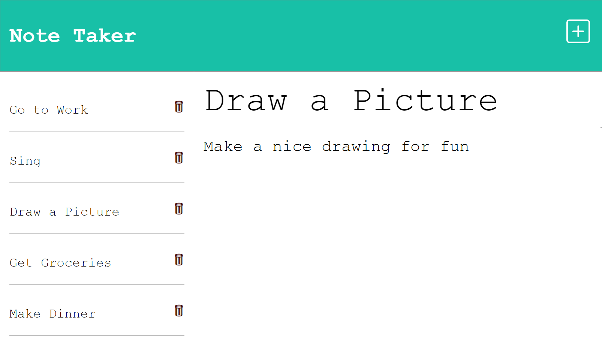
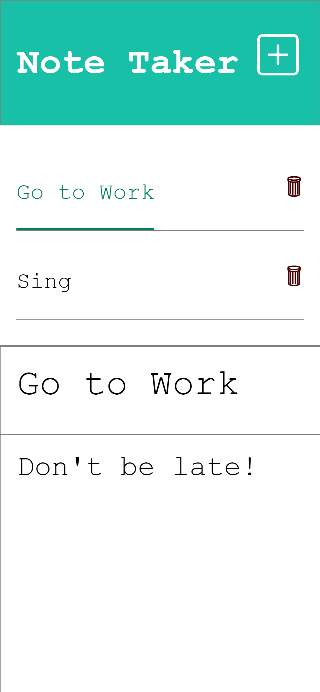

# Note-Taker

## <section id = "License">License</section>
N/A

## <section id = "Description">Description</section>
The application is designed to be responsive, ensuring a seamless user experience across different devices, including mobile devices. The user interface adapts to different screen sizes and orientations, making it easy to use on both desktop and mobile devices.

The notes created by the user are stored in a JSON (JavaScript Object Notation) file, which allows for easy retrieval and manipulation of the notes data. This ensures that the notes are securely stored and can be easily accessed whenever needed.

To create a note, users can enter a title and the note text, and a save button will appear. Clicking on the save button stores the note on the left side of the application for future reference. Users can also click on their past notes to view the content of the notes on the right side of the application, making it easy to review notes.

Adding a new note is simple, as users can click on the "+" sign in the top right corner of the application. To delete a specific note, users can click on the trashcan icon, providing a convenient way to remove notes that are no longer needed.

Overall, the application is user-friendly, responsive, and efficient in storing and managing notes using Express and Node.js technologies.

Link to heroku application: 

Link to github application: 

## Table of Contents
1.) <a href = "#License">License</a> 
2.) <a href = "#Description">Description</a> 
3.) <a href = "#Installation">Installation</a>  
4.) <a href = "#Usage">Usage</a> 
5.) <a href = "#Contributing">Contributing</a> 
6.) <a href = "#Tests">Tests</a> 
7.) <a href = "#Questions">Questions</a>

## <section id = "Installation">Installation</section>
Command to Install Dependencies: npm init -y, npm i express

## <section id = "Usage">Usage</section>
Using the Repo: N/A 

## <section id = "Contributing">Contributing</section>
Contributing to the Repo: Currently not taking contributions.

## <section id = "Tests">Tests</section>
Command to Run Tests: N/A

## <section id = "Questions">Questions</section>
If you have any questions, please feel free to contact me:   
1.) Github Username: Cgotts1  
2.) Email Address: cobi.gottschalk@gmail.com
